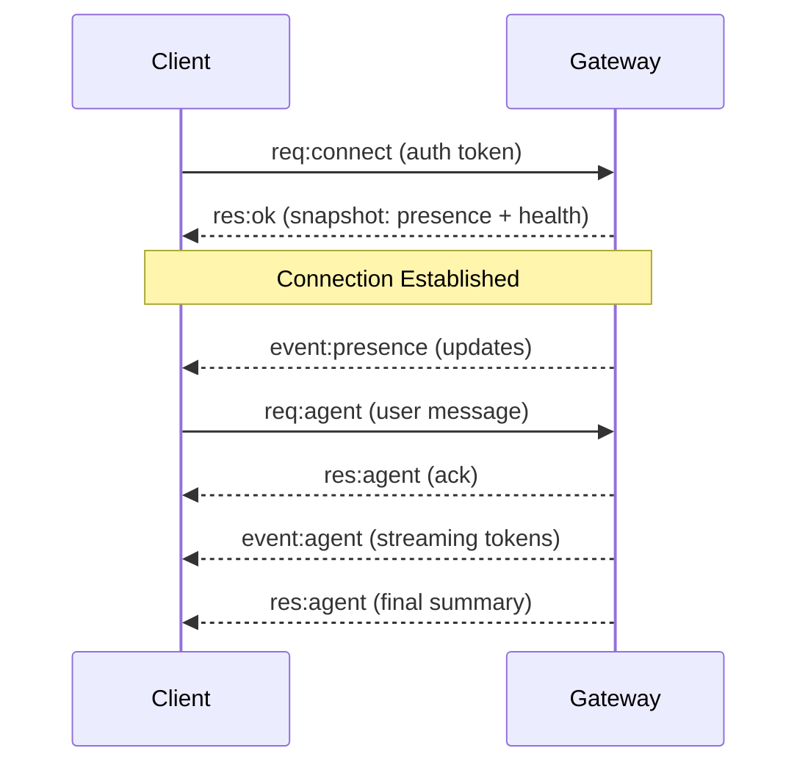

# Gateway Architecture

**OpenClaw Gateway** is the central nervous system of your assistant. It manages connections to messaging platforms (WhatsApp, Telegram, etc.) and routes messages to the Agent Runtime.

## Overview

- **Single Gateway**: One process owns all messaging surfaces.
- **WebSocket Protocol**: Clients (CLI, Web UI, Mobile App) connect via secure WebSocket.
- **Agent Runtime**: The "brain" that processes messages and executes tools.
- **Nodes**: Distributed workers (e.g., a "Camera Node" on an old phone) that extend the Gateway's capabilities.

## Components and Flows

### 1. Gateway (Daemon)
- Maintains persistent connections to providers (Baileys for WhatsApp, grammY for Telegram).
- Exposes a typed WebSocket API.
- Validates inbound frames.
- Emits events: `agent`, `chat`, `presence`, `health`, `cron`.

### 2. Clients (Control Plane)
- **CLI**: `openclaw` command-line tool.
- **Web Admin**: The dashboard for managing agents.
- **Mobile App**: (Coming soon) Native control.

### 3. Nodes (Distributed Capability)
- Any device can run as a **Node** and connect to the Gateway.
- Nodes expose capabilities (e.g., `camera`, `screen`, `location`) to the central agent.
- *Example*: Run a Node on your Mac Mini to give the agent access to iMessage, while the Gateway runs on a VPS.

## Connection Lifecycle



## Wire Protocol

- **Transport**: WebSocket (Text frames with JSON).
- **Auth**: Bearer token (`OPENCLAW_GATEWAY_TOKEN`).
- **Idempotency**: Requests require IDs to allow safe retries.

## Pairing & Security

- **Device Identity**: Every client/node has a unique ID.
- **Pairing**: New devices must be approved by an admin (you).
- **Encryption**: Traffic should be tunneled via **Tailscale** (recommended) or TLS for remote access.

## Remote Access

We strongly recommend **Tailscale** for secure, zero-config remote access.

1.  Install Tailscale on the Gateway machine and your client device.
2.  Connect to the Gateway using its Tailscale IP (e.g., `ws://100.x.y.z:18789`).

Alternatively, use an SSH tunnel:
```bash
ssh -N -L 18789:127.0.0.1:18789 user@host
```

## Invariants

- Exactly **one** Gateway controls a single WhatsApp session.
- Handshake is mandatory.
- Events are not replayed; clients must resync on reconnection.
