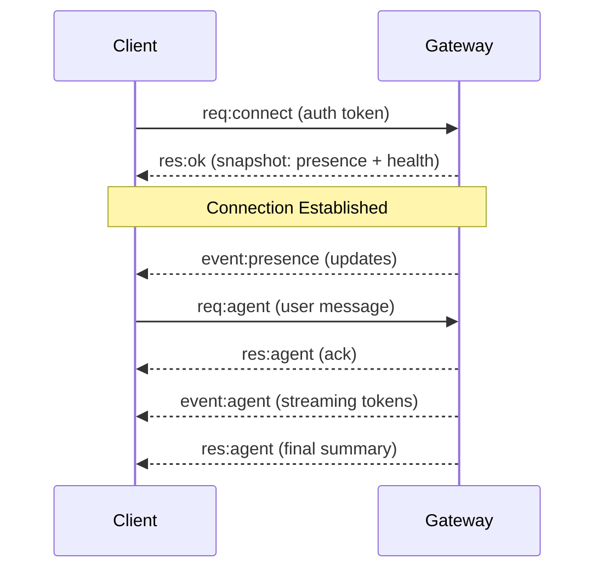

# 网关架构 (Gateway Architecture)

**OpenClaw Gateway** 是你助手的神经中枢。它管理与消息平台（WhatsApp, Telegram 等）的连接，并将消息路由到代理运行时。

## 概览

- **单一 Gateway**：一个进程拥有所有消息界面。
- **WebSocket 协议**：客户端（CLI, Web UI, 移动应用）通过安全 WebSocket 连接。
- **代理运行时 (Agent Runtime)**：处理消息并执行工具的“大脑”。
- **节点 (Nodes)**：扩展 Gateway 能力的分布式工作者（例如，旧手机上的“相机节点”）。

## 组件与流程

### 1. Gateway (守护进程)
- 维护与提供商的持久连接（WhatsApp 的 Baileys, Telegram 的 grammY）。
- 暴露类型化的 WebSocket API。
- 验证入站帧。
- 发出事件：`agent`, `chat`, `presence`, `health`, `cron`。

### 2. 客户端 (控制平面)
- **CLI**：`openclaw` 命令行工具。
- **Web Admin**：用于管理代理的仪表板。
- **Mobile App**：（即将推出）原生控制。

### 3. 节点 (分布式能力)
- 任何设备都可以作为 **节点 (Node)** 运行并连接到 Gateway。
- 节点向中心代理暴露能力（例如 `camera`, `screen`, `location`）。
- *示例*：在你的 Mac Mini 上运行一个节点，让代理访问 iMessage，而 Gateway 运行在 VPS 上。

## 连接生命周期



## 线路协议 (Wire Protocol)

- **传输**：WebSocket（带 JSON 的文本帧）。
- **认证**：Bearer 令牌 (`OPENCLAW_GATEWAY_TOKEN`)。
- **幂等性**：请求需要 ID 以允许安全重试。

## 配对与安全

- **设备身份**：每个客户端/节点都有唯一的 ID。
- **配对**：新设备必须由管理员（你）批准。
- **加密**：流量应通过 **Tailscale**（推荐）或 TLS 进行远程访问隧道传输。

## 远程访问

我们强烈推荐 **Tailscale** 以实现安全、零配置的远程访问。

1.  在 Gateway 机器和你的客户端设备上安装 Tailscale。
2.  使用其 Tailscale IP 连接到 Gateway（例如 `ws://100.x.y.z:18789`）。

或者，使用 SSH 隧道：
```bash
ssh -N -L 18789:127.0.0.1:18789 user@host
```

## 不变性 (Invariants)

- 确切 **一个** Gateway 控制单个 WhatsApp 会话。
- 握手是强制性的。
- 事件不会重放；客户端必须在重新连接时重新同步。
